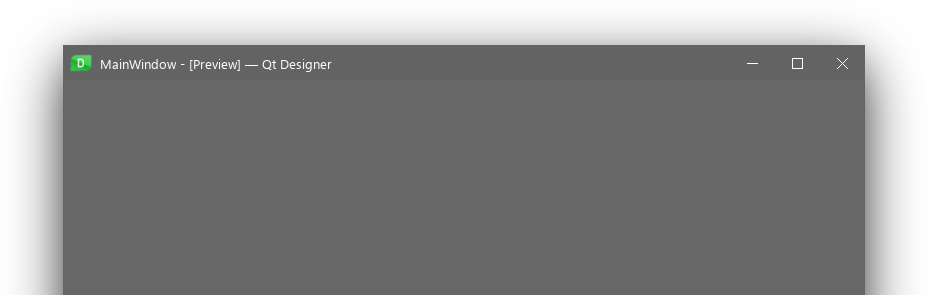

## fluent-decoration

Fluent-ish window decoration theme for KWin.

### Installation

##### Prerequisites

* KDecoration2

##### Building from source

```
mkdir build
cd build
cmake -DCMAKE_INSTALL_PREFIX=/usr ..
make
sudo make install
```
